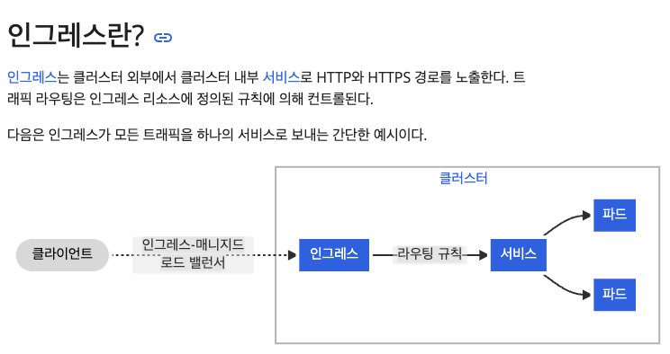
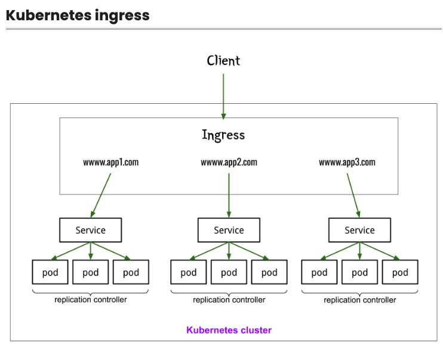

# Setting Redis Using Configmap
- Hello World 파드를 실행한다.
- 외부에서 접근하기 위한 서비스를 생성한다.
- 실행 중인 애플리케이션에 접근해본다.


# Deployments
'Hello, world!'를 출력하는 이미지를 파드로 생성한다.
```
kubectl run --port 8080 --image gcr.io/google-samples/hello-app:1.0 --restart Never helloworld -n test
```


# Service

외부로 노출시키려면 서비스를 생성해야한다.
서비스 유형에는 3가지가 있고 자세한 내용은 문서를 참고한다.
- ClusterIP Service (클러스터내 접속)
- NodePort Service (클러스터 내외 접속)
- LoadBalancer Service(클러스터 내외 접속)

https://kubernetes.io/ko/docs/concepts/services-networking/service/


```commandline
kubectl expose pod helloworld --type ClusterIP --port 8070 --name helloworld-clusterip -n test
```
```commandline
kubectl expose pod helloworld --type NodePort --port 8080 --name helloworld-nodeport -n test
```
```commandline
kubectl expose pod helloworld --type LoadBalancer --port 8090 --name helloworld-loadbalancer -n test
```


# Access

minikube를 사용하고 있다면, 아래 명령어를 통해 자동으로 브라우저 내에서 Hello World 애플리케이션에 접근할 수 있다.
```commandline
minikube service helloworld-nodeport -n test
```
```commandline
curl http://<external-ip>:<port>
```


# Ingress
인그레스는 외부에서 서비스로 접속이 가능한 가상 호스팅을 제공하며,
HTTP와 HTTPS 이외의 서비스를 인터넷에 노출하려면 보통 아래 두가지 유형의 서비스를 사용한다.
- Service.Type=NodePort 또는
- Service.Type=LoadBalancer 




참조 : https://kubernetes.io/ko/docs/concepts/services-networking/ingress/


인그레스를 사용하기 위해선 컨트롤러가 필요하며, nginx 인그레스 컨트롤러를 설치한다.

minikube의 경우 이러한 방식으로 애드온을 활성화하여 Ingress 컨트롤러를 만들 수 있지만, 
클라우드 환경에서는 Ingress 컨트롤러를 설치해야 한다.
```commandline
minikube addons enable ingress
```

설치 확인
```commandline
kubectl get pods -n ingress-nginx
```

인그레스 컨트롤러가 설치되었으면,
yaml파일을 통해 인그레스 생성한다.
```commandline
kubectl apply -f ingress.yaml -n test
```

생성 확인
```commandline
kubectl apply -f ingress.yaml -n test
kubectl describe ingress helloworld -n test
```

minikube(혹은 클러스터)가 할당받은 Ingress 컨트롤러의 IP를 확인한다.
```commandline
minikube ip
or
kubectl get ingress -n test | awk '{ print $4 }'|tail -1
```

ingress를 경유하여 접근해 본다.
```commandline
kubectl run --image curlimages/curl:7.68.0 -it --restart Never --rm curl sh -n test
If you don't see a command prompt, try pressing enter.
/ $ curl 192.168.49.2
Hello, world!
Version: 1.0.0
Hostname: helloworld
/ $
```


